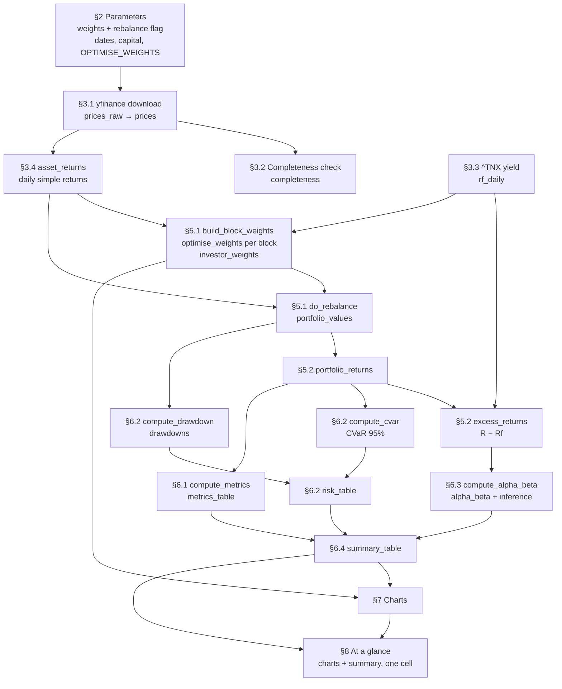

# QF600 Asset Pricing — Compute Alpha

Companion notes for [`QF600 Asset Pricing - Compute Alpha.ipynb`](QF600%20Asset%20Pricing%20-%20Compute%20Alpha.ipynb).

The notebook backtests an **investor portfolio** against a **benchmark portfolio** — each either
rebalanced on a fixed schedule or bought once and held — and splits the outcome into the part
explained by market exposure and the part that is not:

$$R_p - R_f = \alpha + \beta (R_m - R_f) + \varepsilon$$

$\beta$ is the reward for carrying benchmark risk. $\alpha$ is what is left over.

| | Holdings |
|---|---|
| Investor | SOXX (semiconductors) and GLD (gold), re-weighted at every rebalance for maximum Sharpe — or held at a fixed 70/30 when `OPTIMISE_WEIGHTS` is off |
| Benchmark | IVV 60% (S&P 500), AGG 40% (US aggregate bonds) |

Horizon 01 Jan 2016 → today, $100,000 initial capital, rebalanced every 60 trading days (~1 quarter),
252-day annualisation. Each portfolio is declared as a `weights` mix plus a `rebalance` flag, and only
the portfolios whose flag is `True` follow that schedule — set it to `False` and that portfolio is
bought at inception and held, drifting untouched to the last day.

The investor mix is the one moving part. With `OPTIMISE_WEIGHTS = True` (§2) each rebalance solves its
own Markowitz tangency portfolio by Monte Carlo — 1,000 random long-only allocations scored on the
**trailing 252 trading days**, highest Sharpe wins. The estimation window stops where the holding
period starts, so a block is never allocated using the returns it goes on to earn. With the flag off
the notebook is the fixed-weight backtest it was before, unchanged to the last decimal.

---

## 1. Flow



### Section by section

| § | What happens | Objects produced |
|---|---|---|
| 1 | Bootstrap. `ensure_installed` pip-installs `yfinance`, `lets-plot` and `tabulate` (which `DataFrame.to_markdown()` needs in §8) only if missing; detects Colab and loads its interactive table viewer. All third-party imports live here and nowhere else. | `IN_COLAB` |
| 2 | Every tunable in one cell — each portfolio as a `weights` mix plus its own `rebalance` flag, then dates, rebalance frequency, capital, annualisation factor, CVaR confidence level, risk-free ticker, and the `OPTIMISE_WEIGHTS` switch with its Monte Carlo settings (`MC_RUNS`, `LOOKBACK_DAYS`, `RANDOM_SEED`). Asserts each portfolio carries both keys, that `rebalance` is a bool, and that its weights sum to 1.0, then de-duplicates the ticker list. | `TICKERS` |
| 3.1 | One batched `yf.download` with `auto_adjust=True`, so prices are already total-return (splits and dividends folded in). Kept twice: `prices_raw` as returned, `prices` restricted to dates every ticker traded. | `prices_raw`, `prices` |
| 3.2 | Completeness audit per ticker, measured on `prices_raw` before `.dropna()` hides anything. | `completeness` |
| 3.3 | `^TNX` quotes the 10-year yield as an annualised percent. Converted to a compounded daily rate, reindexed onto the equity calendar, forward-filled across yield-market holidays. | `rf_daily` |
| 3.4 | `prices.pct_change()`, with day 0 forced to `0` rather than dropped so every curve starts at exactly `INITIAL_CAPITAL`. Horizon in trading days derived here. | `asset_returns`, `HORIZON_DAYS` |
| 4 | The eight reusable functions — see [§2](#2-methodology-of-the-reusable-functions) below. | — |
| 5.1 | `rebalance_block_days` turns each portfolio's `rebalance` flag into a holding-block length (`REBALANCE_DAYS`, or the whole horizon for buy and hold). `build_block_weights` then resolves the investor's weight schedule (one row per block, either the §2 mix repeated or a max-Sharpe solve per block), and `do_rebalance` runs once per portfolio on its own block length. | `investor_block_days`, `benchmark_block_days`, `investor_weights`, `portfolio_values` |
| 5.2 | Rebalancing only reshuffles an unchanged total, so portfolio return is just the day-over-day change in value, valid across rebalance dates too. Subtracting `rf_daily` gives the regression and Sharpe input. | `portfolio_returns`, `excess_returns` |
| 6.1–6.3 | Metrics, downside risk (max drawdown, plus CVaR as both a percentage and a dollar loss on the latest balance), and the alpha/beta regression, including the significance test of alpha. | `metrics_table`, `drawdowns`, `risk_table`, `alpha_beta` |
| 6.4 | Everything in one table — the §6.1 metrics, the §6.2 risk figures, and *every* key `compute_alpha_beta` returned, inference included — plus a string-formatted display copy whose `format_metric` picks a convention per metric (percent, six-decimal daily, p-value, integer lag count). Alpha and beta are blank for the benchmark: they describe the investor *relative to* it. | `summary_table`, `summary_display` |
| 7 | Equity curve, underwater plot, investor weight band, regression scatter with the fitted line, and a stacked dashboard — all lets-plot. Labels come from `describe()` over the §2 weight mixes, from `describe_rebalancing()` over their `rebalance` flags (so each curve says whether it was rebalanced), and from `investor_label`, which switches to naming the optimiser when the weights are no longer fixed — so they cannot drift from the portfolio actually backtested. | `describe`, `describe_rebalancing`, `investor_label`, `equity_plot`, `drawdown_plot`, `weights_plot`, `alpha_beta_plot`, `dashboard` |
| 8 | **The one cell to read.** Renders the three-panel `dashboard` — equity curve, underwater plot, weight band — and emits `summary_display` as a markdown table, wrapped in a header line (holdings, horizon, capital, each portfolio's rebalancing policy) and the alpha verdict. Change the weights, flip a `rebalance` flag or flip `OPTIMISE_WEIGHTS` in §2, run all, look here — nothing in the cell is hand-typed. | `summary_markdown` |

### Two return series, deliberately

- **Total returns** compound into the equity curve, so the plotted line is real dollars.
- **Excess returns** ($R - R_f$) feed Sharpe and the alpha/beta regression.

Keeping them separate matters over a horizon spanning both the zero-rate era and the 2022+ hiking
cycle, where $R_f$ is anything but a constant.

---

## 2. Methodology of the reusable functions

Eight building blocks, each doing one job.

### `rebalance_block_days` — how long one holding block lasts

```python
rebalance_block_days(portfolio: dict,
                     horizon_days: int,
                     rebalance_days: int) -> int
```

**Input** — a §2 portfolio definition (only its `rebalance` key is read), the horizon in trading days,
and the §2 schedule.
**Output** — `rebalance_days` when the portfolio rebalances, `horizon_days` when it does not.

This is the only place the `rebalance` flag is read, and it is what lets the two functions below stay
oblivious to it. Rebalancing is implemented by cutting the horizon into blocks of `rebalance_days`, so
a block length equal to the horizon leaves exactly one block — and a single block has no interior
rebalance date. Buy and hold therefore needs no separate code path: the weights are applied once, at
inception, each sleeve compounds at its own rate from there, and the mix on the last day is whatever
the market made it.

One consequence worth naming: a buy-and-hold portfolio is block 0 and nothing else, and block 0's
estimation window is empty, so `build_block_weights` hands it the §2 mix whatever `OPTIMISE_WEIGHTS`
says. There is no history in front of inception to fit an allocation on.

### `do_rebalance` — compound a portfolio with periodic rebalancing

```python
do_rebalance(asset_returns: pd.DataFrame,
             weights: dict[str, float] | pd.DataFrame,
             initial_capital: float,
             rebalance_days: int) -> pd.Series
```

**Input** — daily simple returns (DatetimeIndex × ticker columns, row 0 = 0.0), the target weights,
starting dollars, and the rebalance interval in trading days — the horizon length, from
`rebalance_block_days`, for a buy-and-hold portfolio. `weights` is either a **dict** — one
mix held for the whole horizon — or a **DataFrame** of per-block weights from `build_block_weights`,
one row per holding period. A dict is broadcast to every block on entry, so both cases take exactly
the same path afterwards and the fixed-weight result is reproduced to the last cent.
**Output** — a float Series named `"Value"`, indexed like `asset_returns`, holding the portfolio's
dollar value on each date and starting at `initial_capital`.

**Method.** The horizon is cut into fixed-length blocks, `day_index // rebalance_days`, one block per
holding period. Rebalancing is precisely what makes the blocks independent: at each boundary the
portfolio forgets how its weights drifted and restarts from the target mix, so a block's internal
growth depends on nothing before it. That licenses the factorisation

$$V_t = C_{b(t)} \times g_t$$

where $g_t$ is the growth of \$1 invested at target weights at the start of block $b(t)$, and
$C_b$ is the dollar capital the portfolio carried into block $b$. Only one scalar per block crosses
each boundary, so the whole thing vectorises — there is no day loop.

- `value_per_dollar` ($g_t$, a series over **dates**) — `(1+r).groupby(blocks).cumprod()` gives each
  asset's growth of \$1 since its block began, the reset *being* the rebalance; multiplying by that
  block's row of `weights_by_block` applies the target weights fresh in each block, and summing across
  columns collapses the sleeves. Inside a block the weights drift naturally, because each asset
  compounds at its own rate. Nothing about the factorisation cares whether consecutive blocks share a
  weight vector — the rebalance already severed them — which is why per-block weights slot in without
  reintroducing a day loop.
- `capital_at_block_start` ($C_b$, a series over **block numbers**) — `.groupby(blocks).last()` is
  each block's total growth factor; `.shift(1, fill_value=1.0)` hands block $N$ what blocks
  $0 \dots N-1$ earned and gives block 0 a factor of 1.0; `.cumprod()` chains the completed blocks;
  `.mul(initial_capital)` converts to dollars.

`blocks.map(capital_at_block_start)` broadcasts the per-block scalar back onto the calendar, and the
product is the dollar value. On a block's first day the `cumprod` already includes that day's return,
which is intended — the rebalance happens at the prior close, so the new mix earns from day one. The
final block's growth factor is computed but discarded by `shift(1)`, which is also what keeps a
partial trailing block correct.

*Assumes* perfectly divisible weights: no share counts, no transaction costs, no taxes, no cash drag.

### `optimise_weights` — the max-Sharpe portfolio, by Monte Carlo

```python
optimise_weights(window_returns: pd.DataFrame,
                 rf_window: pd.Series,
                 trading_days: int,
                 mc_runs: int,
                 rng: np.random.Generator) -> np.ndarray
```

**What it does.** Given one window of returns, it finds the long-only mix of those assets with the
highest Sharpe ratio — the best return per unit of risk the window has to offer.

| | |
|---|---|
| **Input** | `window_returns` — daily returns, date rows × ticker columns<br>`rf_window` — daily risk-free rate on the same index<br>`trading_days` — annualisation factor (252)<br>`mc_runs` — how many random allocations to try<br>`rng` — a seeded generator, so the search repeats |
| **Output** | a plain `np.ndarray`: one weight per column of `window_returns`, in that order, non-negative and summing to 1.0 |

#### Worked example

Sixty days of returns for three assets:

```python
rng  = np.random.default_rng(0)
days = pd.bdate_range("2024-01-01", periods = 60)

window_returns = pd.DataFrame({"SPY": rng.normal(0.0005, 0.010, 60),
                               "AGG": rng.normal(0.0001, 0.003, 60),
                               "GLD": rng.normal(0.0006, 0.008, 60)}, index = days)
rf_window      = pd.Series(0.00008, index = days)

window_returns.head(3)
```

```
                 SPY       AGG       GLD
2024-01-01  0.001757 -0.001209  0.006901
2024-01-02 -0.000821 -0.003409  0.007353
2024-01-03  0.006904  0.005318  0.001205
```

Over this particular window the three assets happened to land here:

| | ann. return | ann. vol | ann. Sharpe |
|---|---|---|---|
| SPY | 30.1% | 14.4% | 2.093 |
| AGG | 6.9% | 4.8% | 1.432 |
| GLD | −0.7% | 12.6% | −0.059 |

```python
optimise_weights(window_returns, rf_window,
                 trading_days = 252,
                 mc_runs      = 10_000,
                 rng          = np.random.default_rng(42))
```

```
array([0.3153, 0.675 , 0.0097])        # SPY 31.5%, AGG 67.5%, GLD 1.0%
```

Read the answer against the table. GLD lost money over the window, so it is squeezed down to 1%.
AGG takes the largest share despite the *lower* Sharpe of the two survivors, because it is three
times less volatile than SPY and barely moves with it — so it buys a large reduction in portfolio
risk for a small give-up in return. The mix scores an annualised Sharpe of **2.688**, above the best
single asset (2.093) and well above equal weight (1.922). That gap is the whole point of the
exercise: diversification, not stock-picking.

#### Method

Markowitz says an investor holding a risky portfolio alongside a risk-free asset wants the
**tangency portfolio** — the point where the capital allocation line is steepest, which is the same
thing as the highest Sharpe ratio:

$$w^{*} = \arg\max_{w \,\ge\, 0,\ \mathbf{1}'w = 1} \ \frac{\mathbb{E}[w'r - r_f]}{\sigma(w'r - r_f)}\sqrt{252}$$

Rather than solve that, the function **samples** it: draw `mc_runs` random vectors, normalise each
to sum to 1, keep the best. The constraint set is enforced by construction — a normalised
non-negative draw *is* a long-only fully-invested portfolio — so there is no penalty term and no
rejected sample.

The whole search is one matrix product. With $R$ the $T \times k$ window and $W$ the
$\text{runs} \times k$ draw matrix, $R W'$ is every candidate's return path at once
($T \times \text{runs}$), and the Sharpe of all of them is two column-wise reductions:

```python
excess = window_returns.sub(rf_window, axis = "index").to_numpy() @ draws.T
sharpe = excess.mean(axis = 0) / excess.std(axis = 0, ddof = 1) * np.sqrt(trading_days)
```

Because weights sum to 1, subtracting $r_f$ from each asset before weighting is the same as
subtracting it from the portfolio return afterwards, so this is genuinely the portfolio's excess
return. `ddof = 1` and the $\sqrt{252}$ make it the *same* annualised Sharpe `compute_metrics`
reports, so the quantity maximised is the quantity in the summary table. 45 rebalances × 1,000
draws runs in well under a second.

#### What the approximation costs

Sampling only approximates the frontier, in two compounding ways.

The draws thin out exponentially as the universe grows, so a fixed `mc_runs` pins the tangency point
closely for two assets and progressively less well for more. On top of that, **normalising uniform
draws is not uniform on the simplex** — it clusters candidates near equal weight and almost never
proposes a concentrated one. With four assets it puts more than 80% into a single asset in 0.2% of
draws, against 3.2% for a true uniform (Dirichlet) sample; with five, 0.014% against 0.8%.

That matters exactly when the best answer *is* concentrated. Across the 44 rebalance blocks of a
SPY/AGG/GLD/SOXX backtest at `MC_RUNS = 1_000`, measured against an SLSQP solve of the same
objective:

| | mean Sharpe shortfall | worst block |
|---|---|---|
| normalised uniform (as implemented) | 0.016 | 0.208 |
| Dirichlet(1,…,1) — uniform on the simplex | 0.007 | 0.044 |

The worst cases are the early blocks, where the optimum wanted 80%+ in one asset and the sampler
could not reach it. Swapping the two draw lines for `rng.dirichlet(np.ones(k), size = mc_runs)`
removes that particular bias; a quadratic-programming solve would remove both. Neither is done
here — the shortfall is documented rather than hidden.

### `build_block_weights` — the weight schedule across rebalances

```python
build_block_weights(asset_returns: pd.DataFrame,
                    rf_daily: pd.Series,
                    weights: dict[str, float],
                    rebalance_days: int,
                    optimise: bool,
                    lookback_days: int,
                    trading_days: int,
                    mc_runs: int,
                    rng: np.random.Generator,
                    min_window: int = 20) -> pd.DataFrame
```

**What it does.** Calls `optimise_weights` once per rebalance block and stacks the answers into the
table `do_rebalance` consumes — or, with `optimise=False`, just repeats the §2 mix.

| | |
|---|---|
| **Input** | `asset_returns`, `rf_daily` — the full daily series<br>`weights` — the §2 mix; its **keys** define the investable universe, its **values** the fallback<br>`rebalance_days` — the block length from `rebalance_block_days`, so a buy-and-hold portfolio arrives as a single block<br>`optimise`, `lookback_days`, `trading_days`, `mc_runs`, `rng` — the §2 settings<br>`min_window` — shortest history worth estimating from |
| **Output** | a DataFrame indexed `0 … n_blocks-1` by block number, columns ordered like `weights`, every row non-negative and summing to 1.0 |

#### Worked example

Ten trading days, two assets, rebalancing every four days — so three blocks:

```python
asset_returns                       # row 0 forced to 0.0, as at inception
```

```
                 SPY       AGG
2024-01-01  0.000000  0.000000
2024-01-02  0.004000  0.000900
2024-01-03 -0.001700  0.000400
2024-01-04 -0.007900 -0.001700
2024-01-05 -0.003500  0.000100
2024-01-08 -0.008900  0.001600
2024-01-09  0.001600 -0.002500
2024-01-10  0.014400 -0.000700
2024-01-11 -0.003900 -0.003600
2024-01-12 -0.005200 -0.002400
```

With the flag off, the §2 mix is simply repeated — this is the fixed-weight backtest:

```python
build_block_weights(asset_returns, rf_daily, {"SPY": 0.6, "AGG": 0.4},
                    rebalance_days = 4, optimise = False, lookback_days = 8,
                    trading_days = 252, mc_runs = 2_000,
                    rng = np.random.default_rng(42))
```

```
       SPY  AGG
Block
0      0.6  0.4
1      0.6  0.4
2      0.6  0.4
```

With it on, each block is solved on the returns immediately before it:

```python
build_block_weights(..., optimise = True, min_window = 2)
```

```
            SPY       AGG
Block
0      0.600000  0.400000     <- window is empty, falls back to the §2 mix
1      0.000995  0.999005     <- solved on rows [0:4]
2      0.999517  0.000483     <- solved on rows [0:8]
```

Blocks 1 and 2 flip almost completely, which is the honest behaviour of a max-Sharpe fit on four and
eight observations: SPY loses money over the first window and rallies through the second, so the
optimiser chases it. This is precisely what `min_window` exists to prevent — at its real default of
20 it would have refused both, and both blocks would read `0.6 / 0.4`.

#### Method

Block $b$ trades rows $[\,b \cdot \text{rebalance\_days},\ (b+1)\cdot\text{rebalance\_days}\,)$ and
is fitted on

$$\text{window}_b = \text{returns}\big[\max(0,\ b \cdot \text{rebalance\_days} - \text{lookback\_days})
\ :\ b \cdot \text{rebalance\_days}\big]$$

The slice is **half-open on the right at the block's own first row**, which is the whole point: the
weights a block trades were fitted only to returns that had already happened when the rebalance was
placed. Optimising on the full sample instead would hand every block the answer key and inflate
alpha by construction.

Two kinds of block keep the §2 weights instead of being optimised: block 0, whose window is empty,
and any block whose window is still shorter than `min_window` (20 days) — too few observations for a
covariance estimate worth trusting. Note also that a window only reaches its full `lookback_days`
once $b \cdot \text{rebalance\_days}$ exceeds it. With §2's 1,260-day (5-year) lookback and 60-day
blocks, that is **block 21**; blocks 1–20 estimate on a growing partial window, starting from just 60
observations. Those early fits are the noisiest in the schedule and the ones the sampling bias above
hits hardest.

The single `rng` is threaded through every block, so one seed fixes the entire schedule and a re-run
reproduces the backtest exactly.

### `compute_drawdown` — decline from the running peak

```python
compute_drawdown(value: pd.Series) -> pd.Series
```

**Input** — any positive level series, typically `do_rebalance` output.
**Output** — same index; `0.0` on a day that sets a new high, negative below it (`-0.25` = 25% under water).

$$DD_t = \frac{V_t}{\max_{s \le t} V_s} - 1$$

One `cummax`, one division. Called column-wise through `.apply`, hence Series → Series rather than
DataFrame → DataFrame. `drawdowns.min()` and `.idxmin()` then give the worst loss and its date.

### `compute_cvar` — conditional value at risk (expected shortfall)

```python
compute_cvar(portfolio_returns: pd.Series,
             confidence: float = 0.95) -> float
```

**Input** — one portfolio's daily simple returns, and the tail cutoff (`CVAR_CONFIDENCE`, 0.95 in §2).
**Output** — a single negative decimal on the same sign convention as a drawdown: `-0.03` means the
worst 5% of days lose 3% on average.

Value at risk is the quantile that cuts off the left tail; CVaR is the **mean of what lies beyond it**:

$$\mathrm{VaR}_c = Q_{1-c}(r), \qquad
\mathrm{CVaR}_c = \mathbb{E}\!\left[\, r \mid r \le \mathrm{VaR}_c \,\right]
\;=\; \frac{1}{|T_c|}\sum_{t \in T_c} r_t,
\qquad T_c = \{\, t : r_t \le \mathrm{VaR}_c \,\}$$

The function returns the **percentage** and nothing else — that keeps it reusable on any return
series. §6.2 then multiplies it by `portfolio_values.iloc[-1]`, each portfolio's value on the last
date, to state the same tail loss in dollars:

$$\mathrm{CVaR}^{\$}_c = \mathrm{CVaR}_c \times V_{T}$$

So the two CVaR rows in the summary answer different questions. The percentage is a property of the
strategy and is unchanged by how much money is in it; the dollar figure is a property of the
*position*, and grows as the account grows — which is why it is struck against the latest value
rather than `INITIAL_CAPITAL`.

Estimated **historically**: `portfolio_returns.quantile(1 - confidence)` is $\mathrm{VaR}_c$, the
boolean mask `returns <= VaR` selects $T_c$, and `.mean()` averages it. Two lines, no distributional
assumption — the sample's own left tail *is* the estimate, so a fat empirical tail is priced in
rather than normalised away. At $c = 0.95$ the average runs over the worst 5% of the horizon's
trading days — a few dozen observations over a decade.

Why report it next to volatility and max drawdown, which are already in the table:

| Measure | Answers | Blind to |
|---|---|---|
| Annualised volatility | how wide the whole distribution is | which side of the mean, and tail shape |
| VaR | how bad the threshold day is | everything past the threshold |
| CVaR | how bad the tail is *on average* | the path — days are treated independently |
| Max drawdown | the worst peak-to-trough loss along the path | how often, and everything but the single worst episode |

Volatility punishes upside and downside alike and understates fat tails; VaR names a threshold but
says nothing about how far beyond it a loss can go, and is not sub-additive, so it can penalise
diversification. CVaR is the coherent risk measure of the three and is what Basel's market-risk
framework moved to. It is still a *daily* number and path-independent: two portfolios with identical
CVaR can have very different drawdowns depending on whether the bad days cluster. That is exactly why
§6.2 reports it alongside max drawdown rather than instead of it.

### `compute_metrics` — return, volatility, Sharpe

```python
compute_metrics(portfolio_returns: pd.Series,
                rf_daily: pd.Series,
                trading_days: int) -> dict[str, float]
```

**Input** — one portfolio's daily simple returns, the daily risk-free rate on the same index, and the
annualisation factor (252).
**Output** — a six-key dict. Returns and volatilities are decimals (`0.12` = 12%); Sharpe is unitless.

With $N$ = horizon in trading days and $\sigma_d$ = daily standard deviation:

| Metric | Formula |
|---|---|
| Horizon Return | $\prod_t (1 + r_t) - 1$ — geometric, not a sum |
| Annualised Return | $(1 + R_{\text{horizon}})^{252/N} - 1$ (CAGR) |
| Horizon Volatility | $\sigma_d \sqrt{N}$ |
| Annualised Volatility | $\sigma_d \sqrt{252}$ |
| Annualised Sharpe | $\dfrac{\overline{r - r_f}}{\sigma(r - r_f)} \sqrt{252}$ |
| Horizon Sharpe | Annualised Sharpe $\times \sqrt{N/252}$ |

Return compounds geometrically while volatility scales as $\sqrt{\text{time}}$ — the standard i.i.d.
assumption, which understates risk under volatility clustering. Sharpe uses the volatility of
*excess* returns, not of total returns.

### `compute_alpha_beta` — the CAPM-style regression

```python
compute_alpha_beta(excess_investor: pd.Series,
                   excess_benchmark: pd.Series,
                   trading_days: int,
                   confidence: float = 0.95) -> dict[str, float]
```

**Input** — daily investor excess returns (regressand), daily benchmark excess returns (regressor,
same index), the annualisation factor, and the two-sided confidence level for the alpha interval.
**Output** — a dict of point estimates: `"Beta"` (unitless slope), `"Alpha (daily)"` (decimal
intercept), `"Annualised Alpha"` (decimal), `"R-squared"` (0 to 1); plus the inference on alpha:
`"SE Alpha (OLS)"`, `"t-stat (OLS)"`, `"p-value (OLS)"`, `"SE Alpha (HAC)"`, `"t-stat (HAC)"`,
`"p-value (HAC)"`, `"NW Lags"`, and `"Annual Alpha CI Low"` / `"Annual Alpha CI High"` (decimals).

Ordinary least squares in closed form rather than via a regression library:

$$\beta = \frac{\mathrm{Cov}(R_p - R_f,\ R_m - R_f)}{\mathrm{Var}(R_m - R_f)}
\qquad
\alpha_{\text{daily}} = \overline{(R_p - R_f)} - \beta \cdot \overline{(R_m - R_f)}$$

$$\alpha_{\text{annual}} = (1 + \alpha_{\text{daily}})^{252} - 1
\qquad
R^2 = \mathrm{Corr}(R_p - R_f,\ R_m - R_f)^2$$

Both identities are exact for single-regressor OLS: the slope is the covariance ratio, and the fitted
line passes through the sample means. $R^2$ equals the squared correlation only in this univariate
case. The daily alpha is compounded, not multiplied by 252, to stay consistent with the geometric
returns elsewhere.

#### Is the alpha real? — testing $H_0: \alpha = 0$

A point estimate of alpha is not evidence of skill. The function therefore also reports whether the
intercept is distinguishable from zero, under two different standard errors.

The **textbook OLS** error, with $e_t$ the residuals, $n$ observations and $\bar{x}$ the mean regressor:

$$\hat{\sigma}^2 = \frac{\sum e_t^2}{n-2}, \qquad
S_{xx} = \sum (x_t - \bar{x})^2, \qquad
\mathrm{SE}(\hat\alpha) = \hat{\sigma}\sqrt{\frac{1}{n} + \frac{\bar{x}^2}{S_{xx}}}$$

with $t = \hat\alpha / \mathrm{SE}(\hat\alpha)$ and $p = 2\Pr(T_{n-2} > |t|)$ from `scipy.stats`.

That error assumes i.i.d. homoskedastic residuals. Daily returns satisfy neither condition — they are
volatility-clustered and mildly autocorrelated — which makes $\mathrm{SE}(\hat\alpha)$ too small and
the resulting significance too generous. The **Newey-West HAC** error corrects for both. With
$X = [\mathbf{1}, x]$, scores $h_t = e_t X_t$, Bartlett weights $w_j = 1 - j/(L+1)$, and the standard
truncation lag $L = \lfloor 4(n/100)^{2/9} \rfloor$:

$$S = \sum_t h_t h_t' + \sum_{j=1}^{L} w_j \sum_t \left( h_t h_{t-j}' + h_{t-j} h_t' \right),
\qquad V = (X'X)^{-1} S (X'X)^{-1}$$

$\mathrm{SE}_{\text{HAC}}(\hat\alpha) = \sqrt{V_{00}}$, the intercept entry of the sandwich. Raw
(unscaled) sums in $S$ paired with $(X'X)^{-1}$ give the coefficient variance directly, with no extra
factor of $n$. **Where the two disagree, the HAC verdict is the one to believe.**

The reported interval is on annualised alpha, obtained by pushing the daily endpoints through the same
compounding used for the point estimate:

$$\left(1 + \hat\alpha \pm t_{\text{crit}} \cdot \mathrm{SE}_{\text{HAC}}\right)^{252} - 1$$

Compounding is monotone, so the transformed interval keeps its coverage. Note that the t-statistic
belongs to the **daily** alpha: annualisation here is a presentational transform of one estimate, not
a separate test, and a t-stat computed on the compounded figure would not be equivalent.

§7 plots this regression directly — one grey point per trading day, with the fitted line drawn from
the returned `Beta` and `Alpha (daily)`, and the Newey-West verdict in the subtitle.

---

## 3. Assumptions and limitations

- **Frictionless.** No transaction costs, bid-ask spread, taxes, or slippage; fractional shares
  assumed. Rebalancing every 60 trading days is cheap here and would not be in practice — and the
  optimiser makes this bite harder than the fixed mix did, because it routinely swings the allocation
  from one corner of the simplex to the other, turning over most of the book in a single trade.
- **The optimiser is a sampler, not a solver.** 1,000 draws approximate the tangency portfolio rather
  than locate it, and the approximation degrades quickly as assets are added. See
  [`optimise_weights`](#optimise_weights--the-max-sharpe-portfolio-by-monte-carlo).
- **A trailing window removes look-ahead from the weights, not from the experiment.** Each rebalance
  is fitted only to returns that preceded it, so the equity curve is one a real investor could have
  traded. But the *universe* — SOXX and GLD — was still picked after seeing the decade, and the
  lookback, the block length and the flag itself were chosen against this same sample. Honest weights
  inside a hindsight-selected experiment are still a hindsight-selected experiment.
- **Estimated moments are noisy, and max-Sharpe amplifies the noise.** Mean-variance optimisation is
  notoriously unstable in the inputs: a small change in the estimated mean moves the tangency
  portfolio a long way, which is why the solved weights sit at or near a corner most of the time and
  flip between them. On this sample that costs real money — the optimised portfolio finishes *below*
  the fixed 70/30 mix, because a trailing year rotates it into gold after each semiconductor drawdown
  and it is still there for the recovery. That is the honest result, and it is the standard critique
  of naive Markowitz rather than a defect in the implementation.
- **Fixed trading-day schedule.** Rebalances land on a day count, not on calendar quarter-ends, and
  a portfolio with `rebalance: False` never rebalances at all — which is free of trading costs but
  lets the mix drift, so a long horizon ends up holding whatever won, at whatever weight it grew to.
- **Risk-free proxy.** `^TNX` is the 10-year Treasury *yield*, not a 3-month bill. It is the wrong
  duration for a true risk-free rate and will bias Sharpe and alpha whenever the curve is steep or
  inverted.
- **CVaR is only as good as its sample tail.** The historical estimate averages ~70 observations at
  95%, so it carries wide sampling error and can only contain crashes the horizon happens to include.
  It is also computed on daily returns, so it says nothing about a loss accumulated over weeks — that
  is what the max drawdown next to it is for. The dollar column inherits both limits and adds one: it
  is a *single day's* loss on the latest balance, not a loss over the horizon, and it is struck
  against a value that itself moves every day.
- **Intersection calendar.** Any date where a single ticker is missing is dropped from all portfolios.
  §3.2 quantifies the cost.
- **Inference assumes the model is right.** §6.3 tests $H_0: \alpha = 0$ with both OLS and Newey-West
  standard errors, but a t-statistic only asks whether the intercept differs from zero *given this
  regression*. A single benchmark is a thin model of risk: exposure to size, value, momentum, or
  duration would land in the intercept and be read as skill. A significant alpha here is evidence
  against the one-factor null, not proof of skill.
- **The p-value is optimistic regardless of the standard error.** SOXX 70 / GLD 30 was chosen after
  seeing the decade it is tested on, so the test is conditioned on the same data that selected the
  strategy. No standard error corrects for that — the nominal 5% threshold is not the true false
  positive rate. This compounds with the hindsight point below.
- **Chosen in hindsight.** SOXX 70 / GLD 30 over a decade that happened to contain a semiconductor
  boom is a selected backtest, not evidence of a repeatable strategy.
