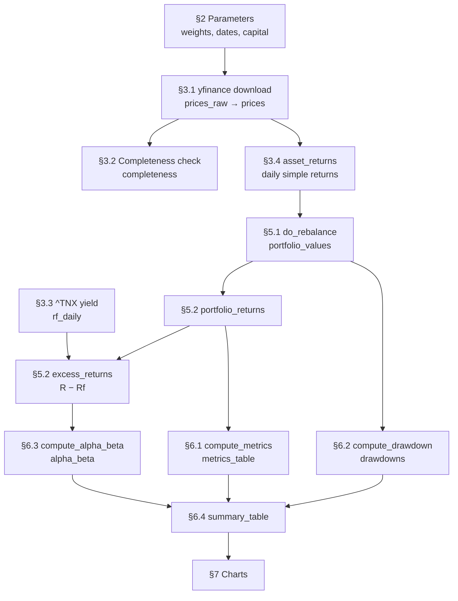

# QF600 Asset Pricing — Compute Alpha

Companion notes for [`QF600 Asset Pricing - Compute Alpha.ipynb`](../QF600%20Asset%20Pricing%20-%20Compute%20Alpha.ipynb).

The notebook backtests an **investor portfolio** against a **benchmark portfolio**, both rebalanced
on a fixed schedule, and splits the outcome into the part explained by market exposure and the part
that is not:

$$R_p - R_f = \alpha + \beta (R_m - R_f) + \varepsilon$$

$\beta$ is the reward for carrying benchmark risk. $\alpha$ is what is left over.

| | Holdings |
|---|---|
| Investor | SOXX 70% (semiconductors), GLD 30% (gold) |
| Benchmark | IVV 60% (S&P 500), AGG 40% (US aggregate bonds) |

Horizon 01 Jan 2016 → today, $100,000 initial capital, rebalanced every 60 trading days (~1 quarter),
252-day annualisation.

---

## 1. Flow



### Section by section

| § | What happens | Objects produced |
|---|---|---|
| 1 | Bootstrap. `ensure_installed` pip-installs `yfinance` and `lets-plot` only if missing; detects Colab and loads its interactive table viewer. All third-party imports live here and nowhere else. | `IN_COLAB` |
| 2 | Every tunable in one cell — weights, dates, rebalance frequency, capital, annualisation factor, risk-free ticker. Asserts each weight vector sums to 1.0 and de-duplicates the ticker list. | `TICKERS` |
| 3.1 | One batched `yf.download` with `auto_adjust=True`, so prices are already total-return (splits and dividends folded in). Kept twice: `prices_raw` as returned, `prices` restricted to dates every ticker traded. | `prices_raw`, `prices` |
| 3.2 | Completeness audit per ticker, measured on `prices_raw` before `.dropna()` hides anything. | `completeness` |
| 3.3 | `^TNX` quotes the 10-year yield as an annualised percent. Converted to a compounded daily rate, reindexed onto the equity calendar, forward-filled across yield-market holidays. | `rf_daily` |
| 3.4 | `prices.pct_change()`, with day 0 forced to `0` rather than dropped so every curve starts at exactly `INITIAL_CAPITAL`. Horizon in trading days derived here. | `asset_returns`, `HORIZON_DAYS` |
| 4 | The four reusable functions — see [§2](#2-methodology-of-the-reusable-functions) below. | — |
| 5.1 | `do_rebalance` run once per portfolio. | `portfolio_values` |
| 5.2 | Rebalancing only reshuffles an unchanged total, so portfolio return is just the day-over-day change in value, valid across rebalance dates too. Subtracting `rf_daily` gives the regression and Sharpe input. | `portfolio_returns`, `excess_returns` |
| 6.1–6.3 | Metrics, drawdowns, and the alpha/beta regression. | `metrics_table`, `drawdowns`, `max_drawdown_table`, `alpha_beta` |
| 6.4 | Everything in one table, plus a string-formatted display copy (alpha and beta are blank for the benchmark — they describe the investor *relative to* it). | `summary_table`, `summary_display` |
| 7 | Equity curve, underwater plot, regression scatter with the fitted line, and a stacked dashboard — all lets-plot. | `equity_plot`, `drawdown_plot`, `alpha_beta_plot`, `dashboard` |
| 8 | Colab notes. Section 1 auto-detects the environment, so **Runtime → Run all** reproduces everything unchanged. | — |

### Two return series, deliberately

- **Total returns** compound into the equity curve, so the plotted line is real dollars.
- **Excess returns** ($R - R_f$) feed Sharpe and the alpha/beta regression.

Keeping them separate matters over a horizon spanning both the zero-rate era and the 2022+ hiking
cycle, where $R_f$ is anything but a constant.

---

## 2. Methodology of the reusable functions

Four building blocks, each doing one job.

### `do_rebalance` — compound a portfolio with periodic rebalancing

```python
do_rebalance(asset_returns: pd.DataFrame,
             weights: dict[str, float],
             initial_capital: float,
             rebalance_days: int) -> pd.Series
```

**Input** — daily simple returns (DatetimeIndex × ticker columns, row 0 = 0.0), target weights whose
keys are a subset of those columns and which sum to 1.0, starting dollars, and the rebalance interval
in trading days.
**Output** — a float Series named `"Value"`, indexed like `asset_returns`, holding the portfolio's
dollar value on each date and starting at `initial_capital`.

**Method.** The horizon is cut into fixed-length blocks, `day_index // rebalance_days`, one block per
holding period. Rebalancing is precisely what makes the blocks independent: at each boundary the
portfolio forgets how its weights drifted and restarts from the target mix, so a block's internal
growth depends on nothing before it. That licenses the factorisation

$$V_t = C_{b(t)} \times g_t$$

where $g_t$ is the growth of \$1 invested at target weights at the start of block $b(t)$, and
$C_b$ is the dollar capital the portfolio carried into block $b$. Only one scalar per block crosses
each boundary, so the whole thing vectorises — there is no day loop.

- `value_per_dollar` ($g_t$, a series over **dates**) — `(1+r).groupby(blocks).cumprod()` gives each
  asset's growth of \$1 since its block began, the reset *being* the rebalance; multiplying by `w`
  applies the target weights fresh in each block, and summing across columns collapses the sleeves.
  Inside a block the weights drift naturally, because each asset compounds at its own rate.
- `capital_at_block_start` ($C_b$, a series over **block numbers**) — `.groupby(blocks).last()` is
  each block's total growth factor; `.shift(1, fill_value=1.0)` hands block $N$ what blocks
  $0 \dots N-1$ earned and gives block 0 a factor of 1.0; `.cumprod()` chains the completed blocks;
  `.mul(initial_capital)` converts to dollars.

`blocks.map(capital_at_block_start)` broadcasts the per-block scalar back onto the calendar, and the
product is the dollar value. On a block's first day the `cumprod` already includes that day's return,
which is intended — the rebalance happens at the prior close, so the new mix earns from day one. The
final block's growth factor is computed but discarded by `shift(1)`, which is also what keeps a
partial trailing block correct.

*Assumes* perfectly divisible weights: no share counts, no transaction costs, no taxes, no cash drag.

### `compute_drawdown` — decline from the running peak

```python
compute_drawdown(value: pd.Series) -> pd.Series
```

**Input** — any positive level series, typically `do_rebalance` output.
**Output** — same index; `0.0` on a day that sets a new high, negative below it (`-0.25` = 25% under water).

$$DD_t = \frac{V_t}{\max_{s \le t} V_s} - 1$$

One `cummax`, one division. Called column-wise through `.apply`, hence Series → Series rather than
DataFrame → DataFrame. `drawdowns.min()` and `.idxmin()` then give the worst loss and its date.

### `compute_metrics` — return, volatility, Sharpe

```python
compute_metrics(portfolio_returns: pd.Series,
                rf_daily: pd.Series,
                trading_days: int) -> dict[str, float]
```

**Input** — one portfolio's daily simple returns, the daily risk-free rate on the same index, and the
annualisation factor (252).
**Output** — a six-key dict. Returns and volatilities are decimals (`0.12` = 12%); Sharpe is unitless.

With $N$ = horizon in trading days and $\sigma_d$ = daily standard deviation:

| Metric | Formula |
|---|---|
| Horizon Return | $\prod_t (1 + r_t) - 1$ — geometric, not a sum |
| Annualised Return | $(1 + R_{\text{horizon}})^{252/N} - 1$ (CAGR) |
| Horizon Volatility | $\sigma_d \sqrt{N}$ |
| Annualised Volatility | $\sigma_d \sqrt{252}$ |
| Annualised Sharpe | $\dfrac{\overline{r - r_f}}{\sigma(r - r_f)} \sqrt{252}$ |
| Horizon Sharpe | Annualised Sharpe $\times \sqrt{N/252}$ |

Return compounds geometrically while volatility scales as $\sqrt{\text{time}}$ — the standard i.i.d.
assumption, which understates risk under volatility clustering. Sharpe uses the volatility of
*excess* returns, not of total returns.

### `compute_alpha_beta` — the CAPM-style regression

```python
compute_alpha_beta(excess_investor: pd.Series,
                   excess_benchmark: pd.Series,
                   trading_days: int) -> dict[str, float]
```

**Input** — daily investor excess returns (regressand), daily benchmark excess returns (regressor,
same index), and the annualisation factor.
**Output** — a four-key dict: `"Beta"` (unitless slope), `"Alpha (daily)"` (decimal intercept),
`"Annualised Alpha"` (decimal), `"R-squared"` (0 to 1).

Ordinary least squares in closed form rather than via a regression library:

$$\beta = \frac{\mathrm{Cov}(R_p - R_f,\ R_m - R_f)}{\mathrm{Var}(R_m - R_f)}
\qquad
\alpha_{\text{daily}} = \overline{(R_p - R_f)} - \beta \cdot \overline{(R_m - R_f)}$$

$$\alpha_{\text{annual}} = (1 + \alpha_{\text{daily}})^{252} - 1
\qquad
R^2 = \mathrm{Corr}(R_p - R_f,\ R_m - R_f)^2$$

Both identities are exact for single-regressor OLS: the slope is the covariance ratio, and the fitted
line passes through the sample means. $R^2$ equals the squared correlation only in this univariate
case. The daily alpha is compounded, not multiplied by 252, to stay consistent with the geometric
returns elsewhere.

§7 plots this regression directly — one grey point per trading day, with the fitted line drawn from
the returned `Beta` and `Alpha (daily)`.

---

## 3. Assumptions and limitations

- **Frictionless.** No transaction costs, bid-ask spread, taxes, or slippage; fractional shares
  assumed. Rebalancing every 60 trading days is cheap here and would not be in practice.
- **Fixed trading-day schedule.** Rebalances land on a day count, not on calendar quarter-ends.
- **Risk-free proxy.** `^TNX` is the 10-year Treasury *yield*, not a 3-month bill. It is the wrong
  duration for a true risk-free rate and will bias Sharpe and alpha whenever the curve is steep or
  inverted.
- **Intersection calendar.** Any date where a single ticker is missing is dropped from all portfolios.
  §3.2 quantifies the cost.
- **No inference.** The regression reports point estimates only — no standard errors, t-statistics,
  or Newey-West correction — so nothing here says whether the alpha is statistically distinguishable
  from zero.
- **Chosen in hindsight.** SOXX 70 / GLD 30 over a decade that happened to contain a semiconductor
  boom is a selected backtest, not evidence of a repeatable strategy.
