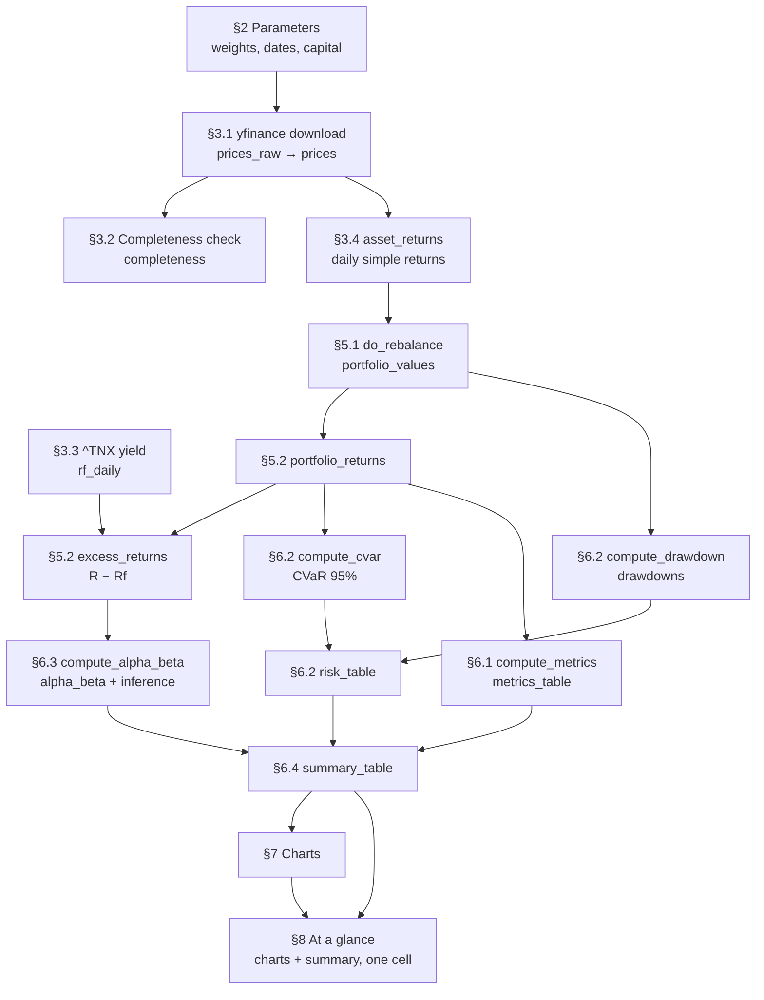

# QF600 Asset Pricing — Compute Alpha

Companion notes for [`QF600 Asset Pricing - Compute Alpha.ipynb`](QF600%20Asset%20Pricing%20-%20Compute%20Alpha.ipynb).

The notebook backtests an **investor portfolio** against a **benchmark portfolio**, both rebalanced
on a fixed schedule, and splits the outcome into the part explained by market exposure and the part
that is not:

$$R_p - R_f = \alpha + \beta (R_m - R_f) + \varepsilon$$

$\beta$ is the reward for carrying benchmark risk. $\alpha$ is what is left over.

| | Holdings |
|---|---|
| Investor | SOXX 70% (semiconductors), GLD 30% (gold) |
| Benchmark | IVV 60% (S&P 500), AGG 40% (US aggregate bonds) |

Horizon 01 Jan 2016 → today, $100,000 initial capital, rebalanced every 60 trading days (~1 quarter),
252-day annualisation.

---

## 1. Flow



### Section by section

| § | What happens | Objects produced |
|---|---|---|
| 1 | Bootstrap. `ensure_installed` pip-installs `yfinance`, `lets-plot` and `tabulate` (which `DataFrame.to_markdown()` needs in §8) only if missing; detects Colab and loads its interactive table viewer. All third-party imports live here and nowhere else. | `IN_COLAB` |
| 2 | Every tunable in one cell — weights, dates, rebalance frequency, capital, annualisation factor, CVaR confidence level, risk-free ticker. Asserts each weight vector sums to 1.0 and de-duplicates the ticker list. | `TICKERS` |
| 3.1 | One batched `yf.download` with `auto_adjust=True`, so prices are already total-return (splits and dividends folded in). Kept twice: `prices_raw` as returned, `prices` restricted to dates every ticker traded. | `prices_raw`, `prices` |
| 3.2 | Completeness audit per ticker, measured on `prices_raw` before `.dropna()` hides anything. | `completeness` |
| 3.3 | `^TNX` quotes the 10-year yield as an annualised percent. Converted to a compounded daily rate, reindexed onto the equity calendar, forward-filled across yield-market holidays. | `rf_daily` |
| 3.4 | `prices.pct_change()`, with day 0 forced to `0` rather than dropped so every curve starts at exactly `INITIAL_CAPITAL`. Horizon in trading days derived here. | `asset_returns`, `HORIZON_DAYS` |
| 4 | The five reusable functions — see [§2](#2-methodology-of-the-reusable-functions) below. | — |
| 5.1 | `do_rebalance` run once per portfolio. | `portfolio_values` |
| 5.2 | Rebalancing only reshuffles an unchanged total, so portfolio return is just the day-over-day change in value, valid across rebalance dates too. Subtracting `rf_daily` gives the regression and Sharpe input. | `portfolio_returns`, `excess_returns` |
| 6.1–6.3 | Metrics, downside risk (max drawdown, plus CVaR as both a percentage and a dollar loss on the latest balance), and the alpha/beta regression, including the significance test of alpha. | `metrics_table`, `drawdowns`, `risk_table`, `alpha_beta` |
| 6.4 | Everything in one table — the §6.1 metrics, the §6.2 risk figures, and *every* key `compute_alpha_beta` returned, inference included — plus a string-formatted display copy whose `format_metric` picks a convention per metric (percent, six-decimal daily, p-value, integer lag count). Alpha and beta are blank for the benchmark: they describe the investor *relative to* it. | `summary_table`, `summary_display` |
| 7 | Equity curve, underwater plot, regression scatter with the fitted line, and a stacked dashboard — all lets-plot. Legend labels come from `describe()` over the §2 weight dicts, so they cannot drift from the portfolio actually backtested. | `describe`, `equity_plot`, `drawdown_plot`, `alpha_beta_plot`, `dashboard` |
| 8 | **The one cell to read.** Re-renders the two curves at 950×520 and emits `summary_display` as a markdown table, wrapped in a header line (weights, horizon, capital, rebalance frequency) and the alpha verdict. Change the weights in §2, run all, look here — nothing in the cell is hand-typed. | `summary_charts`, `summary_markdown` |

### Two return series, deliberately

- **Total returns** compound into the equity curve, so the plotted line is real dollars.
- **Excess returns** ($R - R_f$) feed Sharpe and the alpha/beta regression.

Keeping them separate matters over a horizon spanning both the zero-rate era and the 2022+ hiking
cycle, where $R_f$ is anything but a constant.

---

## 2. Methodology of the reusable functions

Five building blocks, each doing one job.

### `do_rebalance` — compound a portfolio with periodic rebalancing

```python
do_rebalance(asset_returns: pd.DataFrame,
             weights: dict[str, float],
             initial_capital: float,
             rebalance_days: int) -> pd.Series
```

**Input** — daily simple returns (DatetimeIndex × ticker columns, row 0 = 0.0), target weights whose
keys are a subset of those columns and which sum to 1.0, starting dollars, and the rebalance interval
in trading days.
**Output** — a float Series named `"Value"`, indexed like `asset_returns`, holding the portfolio's
dollar value on each date and starting at `initial_capital`.

**Method.** The horizon is cut into fixed-length blocks, `day_index // rebalance_days`, one block per
holding period. Rebalancing is precisely what makes the blocks independent: at each boundary the
portfolio forgets how its weights drifted and restarts from the target mix, so a block's internal
growth depends on nothing before it. That licenses the factorisation

$$V_t = C_{b(t)} \times g_t$$

where $g_t$ is the growth of \$1 invested at target weights at the start of block $b(t)$, and
$C_b$ is the dollar capital the portfolio carried into block $b$. Only one scalar per block crosses
each boundary, so the whole thing vectorises — there is no day loop.

- `value_per_dollar` ($g_t$, a series over **dates**) — `(1+r).groupby(blocks).cumprod()` gives each
  asset's growth of \$1 since its block began, the reset *being* the rebalance; multiplying by `w`
  applies the target weights fresh in each block, and summing across columns collapses the sleeves.
  Inside a block the weights drift naturally, because each asset compounds at its own rate.
- `capital_at_block_start` ($C_b$, a series over **block numbers**) — `.groupby(blocks).last()` is
  each block's total growth factor; `.shift(1, fill_value=1.0)` hands block $N$ what blocks
  $0 \dots N-1$ earned and gives block 0 a factor of 1.0; `.cumprod()` chains the completed blocks;
  `.mul(initial_capital)` converts to dollars.

`blocks.map(capital_at_block_start)` broadcasts the per-block scalar back onto the calendar, and the
product is the dollar value. On a block's first day the `cumprod` already includes that day's return,
which is intended — the rebalance happens at the prior close, so the new mix earns from day one. The
final block's growth factor is computed but discarded by `shift(1)`, which is also what keeps a
partial trailing block correct.

*Assumes* perfectly divisible weights: no share counts, no transaction costs, no taxes, no cash drag.

### `compute_drawdown` — decline from the running peak

```python
compute_drawdown(value: pd.Series) -> pd.Series
```

**Input** — any positive level series, typically `do_rebalance` output.
**Output** — same index; `0.0` on a day that sets a new high, negative below it (`-0.25` = 25% under water).

$$DD_t = \frac{V_t}{\max_{s \le t} V_s} - 1$$

One `cummax`, one division. Called column-wise through `.apply`, hence Series → Series rather than
DataFrame → DataFrame. `drawdowns.min()` and `.idxmin()` then give the worst loss and its date.

### `compute_cvar` — conditional value at risk (expected shortfall)

```python
compute_cvar(portfolio_returns: pd.Series,
             confidence: float = 0.95) -> float
```

**Input** — one portfolio's daily simple returns, and the tail cutoff (`CVAR_CONFIDENCE`, 0.95 in §2).
**Output** — a single negative decimal on the same sign convention as a drawdown: `-0.03` means the
worst 5% of days lose 3% on average.

Value at risk is the quantile that cuts off the left tail; CVaR is the **mean of what lies beyond it**:

$$\mathrm{VaR}_c = Q_{1-c}(r), \qquad
\mathrm{CVaR}_c = \mathbb{E}\!\left[\, r \mid r \le \mathrm{VaR}_c \,\right]
\;=\; \frac{1}{|T_c|}\sum_{t \in T_c} r_t,
\qquad T_c = \{\, t : r_t \le \mathrm{VaR}_c \,\}$$

The function returns the **percentage** and nothing else — that keeps it reusable on any return
series. §6.2 then multiplies it by `portfolio_values.iloc[-1]`, each portfolio's value on the last
date, to state the same tail loss in dollars:

$$\mathrm{CVaR}^{\$}_c = \mathrm{CVaR}_c \times V_{T}$$

So the two CVaR rows in the summary answer different questions. The percentage is a property of the
strategy and is unchanged by how much money is in it; the dollar figure is a property of the
*position*, and grows as the account grows — which is why it is struck against the latest value
rather than `INITIAL_CAPITAL`.

Estimated **historically**: `portfolio_returns.quantile(1 - confidence)` is $\mathrm{VaR}_c$, the
boolean mask `returns <= VaR` selects $T_c$, and `.mean()` averages it. Two lines, no distributional
assumption — the sample's own left tail *is* the estimate, so a fat empirical tail is priced in
rather than normalised away. At $c = 0.95$ the average runs over the worst 5% of the horizon's
trading days — a few dozen observations over a decade.

Why report it next to volatility and max drawdown, which are already in the table:

| Measure | Answers | Blind to |
|---|---|---|
| Annualised volatility | how wide the whole distribution is | which side of the mean, and tail shape |
| VaR | how bad the threshold day is | everything past the threshold |
| CVaR | how bad the tail is *on average* | the path — days are treated independently |
| Max drawdown | the worst peak-to-trough loss along the path | how often, and everything but the single worst episode |

Volatility punishes upside and downside alike and understates fat tails; VaR names a threshold but
says nothing about how far beyond it a loss can go, and is not sub-additive, so it can penalise
diversification. CVaR is the coherent risk measure of the three and is what Basel's market-risk
framework moved to. It is still a *daily* number and path-independent: two portfolios with identical
CVaR can have very different drawdowns depending on whether the bad days cluster. That is exactly why
§6.2 reports it alongside max drawdown rather than instead of it.

### `compute_metrics` — return, volatility, Sharpe

```python
compute_metrics(portfolio_returns: pd.Series,
                rf_daily: pd.Series,
                trading_days: int) -> dict[str, float]
```

**Input** — one portfolio's daily simple returns, the daily risk-free rate on the same index, and the
annualisation factor (252).
**Output** — a six-key dict. Returns and volatilities are decimals (`0.12` = 12%); Sharpe is unitless.

With $N$ = horizon in trading days and $\sigma_d$ = daily standard deviation:

| Metric | Formula |
|---|---|
| Horizon Return | $\prod_t (1 + r_t) - 1$ — geometric, not a sum |
| Annualised Return | $(1 + R_{\text{horizon}})^{252/N} - 1$ (CAGR) |
| Horizon Volatility | $\sigma_d \sqrt{N}$ |
| Annualised Volatility | $\sigma_d \sqrt{252}$ |
| Annualised Sharpe | $\dfrac{\overline{r - r_f}}{\sigma(r - r_f)} \sqrt{252}$ |
| Horizon Sharpe | Annualised Sharpe $\times \sqrt{N/252}$ |

Return compounds geometrically while volatility scales as $\sqrt{\text{time}}$ — the standard i.i.d.
assumption, which understates risk under volatility clustering. Sharpe uses the volatility of
*excess* returns, not of total returns.

### `compute_alpha_beta` — the CAPM-style regression

```python
compute_alpha_beta(excess_investor: pd.Series,
                   excess_benchmark: pd.Series,
                   trading_days: int,
                   confidence: float = 0.95) -> dict[str, float]
```

**Input** — daily investor excess returns (regressand), daily benchmark excess returns (regressor,
same index), the annualisation factor, and the two-sided confidence level for the alpha interval.
**Output** — a dict of point estimates: `"Beta"` (unitless slope), `"Alpha (daily)"` (decimal
intercept), `"Annualised Alpha"` (decimal), `"R-squared"` (0 to 1); plus the inference on alpha:
`"SE Alpha (OLS)"`, `"t-stat (OLS)"`, `"p-value (OLS)"`, `"SE Alpha (HAC)"`, `"t-stat (HAC)"`,
`"p-value (HAC)"`, `"NW Lags"`, and `"Annual Alpha CI Low"` / `"Annual Alpha CI High"` (decimals).

Ordinary least squares in closed form rather than via a regression library:

$$\beta = \frac{\mathrm{Cov}(R_p - R_f,\ R_m - R_f)}{\mathrm{Var}(R_m - R_f)}
\qquad
\alpha_{\text{daily}} = \overline{(R_p - R_f)} - \beta \cdot \overline{(R_m - R_f)}$$

$$\alpha_{\text{annual}} = (1 + \alpha_{\text{daily}})^{252} - 1
\qquad
R^2 = \mathrm{Corr}(R_p - R_f,\ R_m - R_f)^2$$

Both identities are exact for single-regressor OLS: the slope is the covariance ratio, and the fitted
line passes through the sample means. $R^2$ equals the squared correlation only in this univariate
case. The daily alpha is compounded, not multiplied by 252, to stay consistent with the geometric
returns elsewhere.

#### Is the alpha real? — testing $H_0: \alpha = 0$

A point estimate of alpha is not evidence of skill. The function therefore also reports whether the
intercept is distinguishable from zero, under two different standard errors.

The **textbook OLS** error, with $e_t$ the residuals, $n$ observations and $\bar{x}$ the mean regressor:

$$\hat{\sigma}^2 = \frac{\sum e_t^2}{n-2}, \qquad
S_{xx} = \sum (x_t - \bar{x})^2, \qquad
\mathrm{SE}(\hat\alpha) = \hat{\sigma}\sqrt{\frac{1}{n} + \frac{\bar{x}^2}{S_{xx}}}$$

with $t = \hat\alpha / \mathrm{SE}(\hat\alpha)$ and $p = 2\Pr(T_{n-2} > |t|)$ from `scipy.stats`.

That error assumes i.i.d. homoskedastic residuals. Daily returns satisfy neither condition — they are
volatility-clustered and mildly autocorrelated — which makes $\mathrm{SE}(\hat\alpha)$ too small and
the resulting significance too generous. The **Newey-West HAC** error corrects for both. With
$X = [\mathbf{1}, x]$, scores $h_t = e_t X_t$, Bartlett weights $w_j = 1 - j/(L+1)$, and the standard
truncation lag $L = \lfloor 4(n/100)^{2/9} \rfloor$:

$$S = \sum_t h_t h_t' + \sum_{j=1}^{L} w_j \sum_t \left( h_t h_{t-j}' + h_{t-j} h_t' \right),
\qquad V = (X'X)^{-1} S (X'X)^{-1}$$

$\mathrm{SE}_{\text{HAC}}(\hat\alpha) = \sqrt{V_{00}}$, the intercept entry of the sandwich. Raw
(unscaled) sums in $S$ paired with $(X'X)^{-1}$ give the coefficient variance directly, with no extra
factor of $n$. **Where the two disagree, the HAC verdict is the one to believe.**

The reported interval is on annualised alpha, obtained by pushing the daily endpoints through the same
compounding used for the point estimate:

$$\left(1 + \hat\alpha \pm t_{\text{crit}} \cdot \mathrm{SE}_{\text{HAC}}\right)^{252} - 1$$

Compounding is monotone, so the transformed interval keeps its coverage. Note that the t-statistic
belongs to the **daily** alpha: annualisation here is a presentational transform of one estimate, not
a separate test, and a t-stat computed on the compounded figure would not be equivalent.

§7 plots this regression directly — one grey point per trading day, with the fitted line drawn from
the returned `Beta` and `Alpha (daily)`, and the Newey-West verdict in the subtitle.

---

## 3. Assumptions and limitations

- **Frictionless.** No transaction costs, bid-ask spread, taxes, or slippage; fractional shares
  assumed. Rebalancing every 60 trading days is cheap here and would not be in practice.
- **Fixed trading-day schedule.** Rebalances land on a day count, not on calendar quarter-ends.
- **Risk-free proxy.** `^TNX` is the 10-year Treasury *yield*, not a 3-month bill. It is the wrong
  duration for a true risk-free rate and will bias Sharpe and alpha whenever the curve is steep or
  inverted.
- **CVaR is only as good as its sample tail.** The historical estimate averages ~70 observations at
  95%, so it carries wide sampling error and can only contain crashes the horizon happens to include.
  It is also computed on daily returns, so it says nothing about a loss accumulated over weeks — that
  is what the max drawdown next to it is for. The dollar column inherits both limits and adds one: it
  is a *single day's* loss on the latest balance, not a loss over the horizon, and it is struck
  against a value that itself moves every day.
- **Intersection calendar.** Any date where a single ticker is missing is dropped from all portfolios.
  §3.2 quantifies the cost.
- **Inference assumes the model is right.** §6.3 tests $H_0: \alpha = 0$ with both OLS and Newey-West
  standard errors, but a t-statistic only asks whether the intercept differs from zero *given this
  regression*. A single benchmark is a thin model of risk: exposure to size, value, momentum, or
  duration would land in the intercept and be read as skill. A significant alpha here is evidence
  against the one-factor null, not proof of skill.
- **The p-value is optimistic regardless of the standard error.** SOXX 70 / GLD 30 was chosen after
  seeing the decade it is tested on, so the test is conditioned on the same data that selected the
  strategy. No standard error corrects for that — the nominal 5% threshold is not the true false
  positive rate. This compounds with the hindsight point below.
- **Chosen in hindsight.** SOXX 70 / GLD 30 over a decade that happened to contain a semiconductor
  boom is a selected backtest, not evidence of a repeatable strategy.
